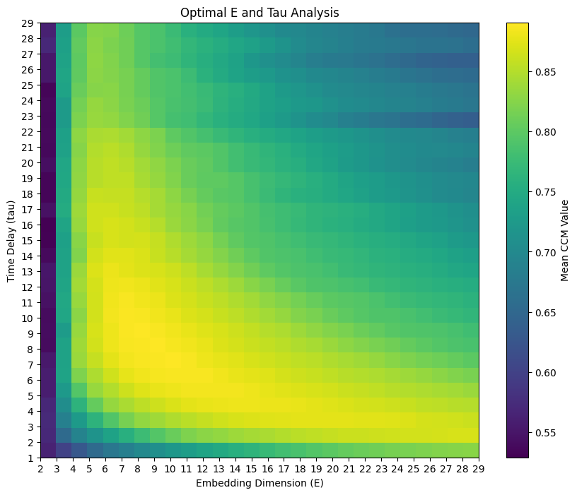

# FastCCM
PyTorch-based implementation of Convergent Cross Mapping (CCM) optimized for calculating pairwise CCM matrices.

## Installation

*Requirements*: Python ≥ 3.9, pip.

*CPU-only:*
```bash
pip install --upgrade pip
pip install torch==2.3.1 --index-url https://download.pytorch.org/whl/cpu
pip install "fastccm @ git+https://github.com/z7743/FastCCM.git"
```

*CUDA:*
```bash
pip install --upgrade pip
pip install torch==2.3.1 --index-url https://download.pytorch.org/whl/cu121
pip install "fastccm @ git+https://github.com/z7743/FastCCM.git"
```

*macOS (CPU/MPS):*
```bash
pip install --upgrade pip
pip install torch==2.3.1
pip install "fastccm @ git+https://github.com/z7743/FastCCM.git"
```

## Quick start

This example demonstrates how to use the FastCCM package for performing Convergent Cross Mapping (CCM).

1. Import Required Libraries

```python
from fastccm import PairwiseCCM, utils
from fastccm.data import get_truncated_rossler_lorenz_rand
import numpy as np
```

2. Initialize the CCM Object

Specify the device to use (e.g., "cpu" or "cuda"):

```python
ccm = PairwiseCCM(device="cpu")
```

3. Generate Data

```python
# Generate a joint Rossler-Lorenz data
X = get_truncated_rossler_lorenz_rand(400, 20000, alpha=6, C=2, seed=0)

Rossler_emb = utils.embed(X[:, 0], E = 7, tau = 4)   # see find_optimal_embedding_params
Lorenz_emb  = utils.embed(X[:, 3], E = 8, tau = 9)

print(f"Rossler embedding shape: {Rossler_emb.shape}")
print(f"Lorenz embedding shape: {Lorenz_emb.shape}")

```


### Calculate cross-mapping prediction

```python
# Rossler cross-mapping Lorenz
result_rossler_xmap_lorenz = ccm.score_matrix(
    X_emb=Rossler_emb, 
    Y_emb=Lorenz_emb, 
    library_size=None,  # use maximum points
    sample_size=300,    # use 300 random points to estimate the score
    exclusion_window=50, 
    tp=0, 
    method="simplex",
    seed=0
)

# Lorenz cross-mapping Rossler
result_lorenz_xmap_rossler = ccm.score_matrix(
    X_emb=Lorenz_emb, 
    Y_emb=Rossler_emb, 
    library_size=None, 
    sample_size=300, 
    exclusion_window=50, 
    tp=0, 
    method="simplex",
    seed=0
)

print(f"Rossler xmap Lorenz. Shape: {result_rossler_xmap_lorenz.shape}, score: {result_rossler_xmap_lorenz[-1,0,0]:.3f}")
print(f"Lorenz xmap Rossler. Shape: {result_lorenz_xmap_rossler.shape}, score: {result_lorenz_xmap_rossler[-1,0,0]:.3f}")

```

### Test convergence

```python
from fastccm import ccm_utils

conv_test_res = ccm_utils.Functions("cpu").convergence_test(
    X_emb=Rossler_emb, 
    Y_emb=Lorenz_emb,
    library_sizes=[160, 320, 640, 1250, 2500, 5000, 10000, 20000],
    sample_size=1000, 
    exclusion_window=50, 
    tp=0, 
    method="simplex", 
    trials=20,
    seed=0
)
```

Plot the convergence test results:
```python
ccm_utils.Visualizer().plot_convergence_test(conv_test_res)
```


### Find optimal time-delay embedding parameters
```python

optimal_E_tau_res = ccm_utils.Functions("cpu").find_optimal_embedding_params(
    X[:,3], 
    library_size=4000, 
    sample_size=300, 
    exclusion_window=50,
    E_range=np.arange(2,30),
    tau_range=np.arange(1,30),
    tp_max=50,
    method="simplex",
    seed=0
)

print(f"Optimal E: {optimal_E_tau_res['optimal_E']}, optimal_tau: {optimal_E_tau_res['optimal_tau']}")
```

Plot the results
```python
ccm_utils.Visualizer().visualize_optimal_e_tau(optimal_E_tau_res)
```


